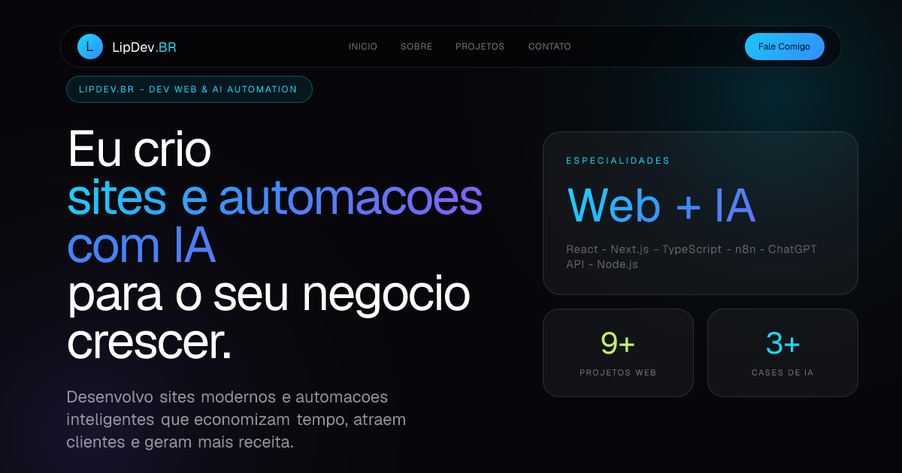
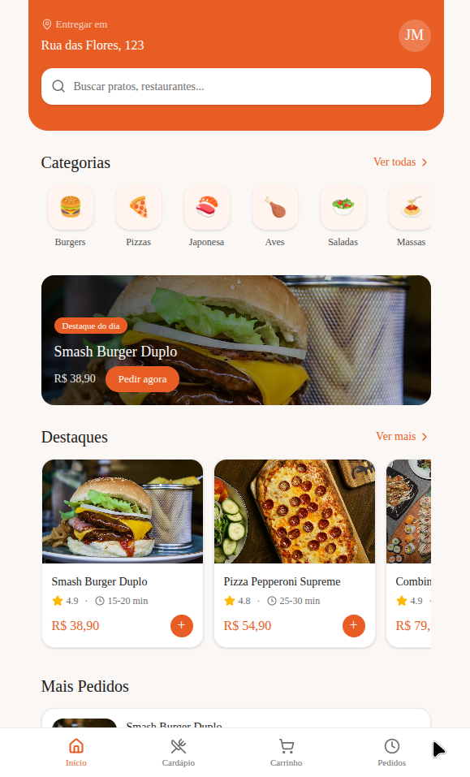

# Portfólio LipDev.BR

Portfólio profissional de Hamilton Felipe, desenvolvedor web com foco em React, Next.js, TypeScript e experimentos de automação com IA.

**Site oficial:** [https://lipdev.vercel.app](https://lipdev.vercel.app)



## Visão geral

O projeto reúne apresentação profissional, currículo, projetos públicos, serviços e canais de contato em uma experiência responsiva. A interface oferece tradução entre português e inglês, temas claro e escuro e uma demonstração incorporada do jogo Dev Balatro.

## Tecnologias

- Next.js 16 com App Router
- React 19
- TypeScript
- Tailwind CSS v4
- Framer Motion
- React Hook Form e Zod
- EmailJS para o fluxo de contato
- Zustand e Web Audio API no Dev Balatro

## Projetos em destaque

| Projeto | Estado apresentado | Repositório | Demonstração |
| --- | --- | --- | --- |
| Portfólio LipDev | Aplicação completa | [Código](https://github.com/LipDev-sudo/Portifolio) | [Online](https://lipdev.vercel.app) |
| Bookly | Em desenvolvimento | [Código](https://github.com/LipDev-sudo/bookly) | Ainda não publicada |
| Dashboard G-Pro | Demonstração funcional | [Código](https://github.com/LipDev-sudo/Dashboard-G-Pro) | [Online](https://dashboard-g-pro.vercel.app) |
| Plataforma de Pedidos | Protótipo | [Código](https://github.com/LipDev-sudo/plataforma-de-pedidos-online-) | [Online](https://plataforma-de-pedidos-online-two.vercel.app) |
| Plataforma de Cursos | Protótipo | [Código](https://github.com/LipDev-sudo/Plataforma-de-cursos-online) | [Online](https://plataforma-de-cursos-online-tau.vercel.app) |

## Capturas de projetos

| Plataforma de Pedidos | Plataforma de Cursos |
| --- | --- |
|  |  |

Novas capturas reais podem ser adicionadas nesta seção conforme os projetos destacados receberem demonstrações públicas.

## Execução local

### Requisitos

- Node.js 20 ou superior
- npm

### Instalação

```bash
git clone https://github.com/LipDev-sudo/Portifolio.git
cd Portifolio
npm ci
```

Copie `.env.example` para `.env.local` e preencha apenas as integrações que pretende usar. O site pode ser executado sem as credenciais de contato, mas o envio de mensagens permanecerá indisponível.

```bash
npm run dev
```

Acesse [http://localhost:3000](http://localhost:3000).

## Variáveis de ambiente

As variáveis e orientações estão documentadas em [`.env.example`](.env.example). Não envie `.env.local`, chaves privadas ou tokens para o repositório.

## Validação

```bash
npm run lint
npx tsc --noEmit
npm run build
```

O repositório ainda não possui uma suíte automatizada de testes. Os fluxos visuais e interativos são revisados com Playwright antes da publicação.

## Estrutura principal

```text
src/
├── app/          # rotas, metadata e APIs
├── components/   # layout, seções, cards e jogo incorporado
├── data/         # projetos e serviços apresentados
├── lib/          # internacionalização, contato, tema e utilitários
└── types/        # contratos TypeScript
```

## Autor

Hamilton Felipe Soares da Silva

- [GitHub](https://github.com/LipDev-sudo)
- [LinkedIn](https://www.linkedin.com/in/hamilton-felipe-875054383/)
- [Portfólio](https://lipdev.vercel.app)
